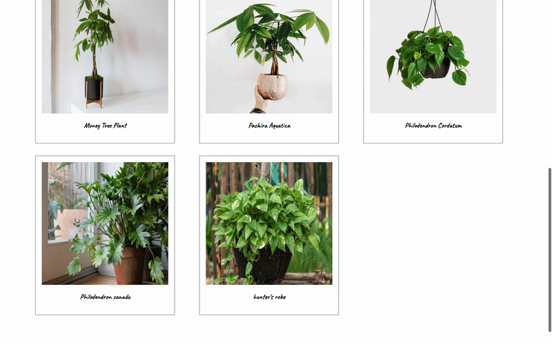
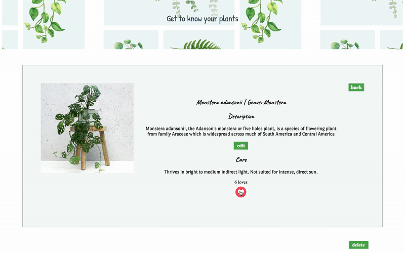

<h1 align="center">:leaves:PlantPedia:leaves:</h1>
<em><h4 align="center"> Get to know your plants. </h4></em>

  A <code>JavaScript</code> application that help Plant Lovers get information about House Plants!

  Built with ♥ by
    <b>Saima Rahman</b>
  

 

Home Page          |  Plant Show Page
:-------------------------:|:-------------------------:
  |  

## Features 
- View Plant HomePage
- Sort Plants by Genus
- Create Plant 
- Edit/Delete Plant 
- Love/Like a Plant

## Tech Stack
This web app is built with the following:

**[Backend](https://github.com/saimaar/PlantPedia-API)**
- Ruby [2.6.1]
- Rails [~> 6.0.2] - MVC web framework used as an API
- Active Model Serializers [~> 0.10.0] - Serializing API routes to JSON
- PostgreSQL [>= 0.18, < 2.0] - Database

**Front End**
- Vanilla JavaScript [ES6]
- Custom CSS3 styling 

## Installation

**Backend Installation:**

- Clone [backend repo](https://github.com/saimaar/PlantPedia-API) to local machine `git clone <backend-repo-url>`
- run `bundle install` to install required dependencies
- run `rails db:create` to create a database locally.
- run `rails db:migrate` to create tables into the database.
- run `rails db:seed` to create seed data.
- run `rails s` to run the server. 

**Frontend Installation:** 

- Clone this repo to your local machine `git clone <this-repo-url>`
- Ensure *PlantPedia-API* is running locally on `http://localhost:3000/`
- run `open index.html` on termial.
